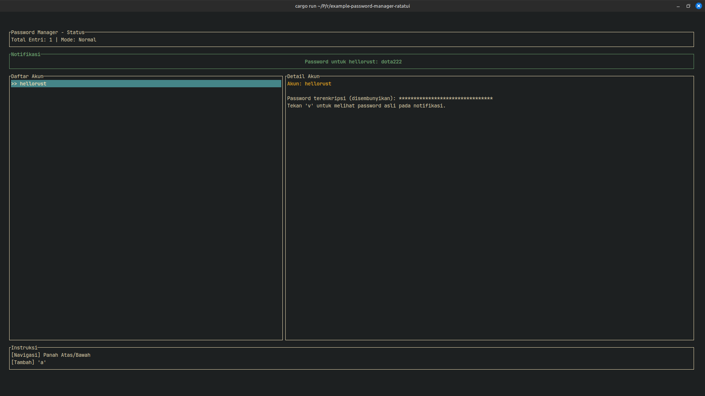

# Example Password Manager In Ratatui

## Ringkasan Proyek

Aplikasi ini adalah manajer kata sandi sederhana berbasis terminal yang dibuat dengan Rust dan pustaka `ratatui`. Aplikasi ini memungkinkan pengguna untuk menyimpan dan melihat entri akun dan kata sandi dengan aman. Kata sandi dienkripsi menggunakan AES-256-GCM sebelum disimpan ke file lokal (`passwords.txt`).

### Demo



## Arsitektur

Aplikasi ini menggunakan model UI berbasis status tunggal yang dikelola dalam `App struct`. Loop utama menangani input keyboard untuk memanipulasi status aplikasi, dan UI dirender ulang pada setiap iterasi untuk mencerminkan status saat ini.

-   **State Management**: `App struct` menyimpan semua status aplikasi, termasuk daftar entri, item yang dipilih, mode input saat ini (normal, mengedit), dan pesan umpan balik.
-   **Rendering**: Fungsi `ui` bertanggung jawab untuk menggambar antarmuka pengguna menggunakan komponen `ratatui` berdasarkan status aplikasi saat ini.
-   **Enkripsi**: Kata sandi dienkripsi menggunakan AES-256-GCM. Kunci enkripsi berasal dari variabel lingkungan `PASSWORD_MANAGER_KEY` menggunakan SHA-256.
-   **Penyimpanan**: Entri yang dienkripsi disimpan dalam file `passwords.txt` dalam format `nama_akun,kata_sandi_terenkripsi`.

## Cara Menjalankan Secara Lokal

Untuk mengkloning dan menjalankan aplikasi ini di lingkungan lokal Anda, ikuti langkah-langkah berikut.

### Prasyarat

-   [Rust](https://www.rust-lang.org/tools/install)
-   [Git](https://git-scm.com/book/en/v2/Getting-Started-Installing-Git)

### 1. Kloning Repositori

Kloning repositori ini ke mesin lokal Anda menggunakan Git.

```bash
git clone https://github.com/MamangRust/example-password-manager-ratatui.git
cd example-password-manager-ratatui
```
*(Catatan: URL repositori di atas adalah placeholder.)*

### 2. Siapkan Kunci Enkripsi

Aplikasi ini memerlukan variabel lingkungan `PASSWORD_MANAGER_KEY` untuk mengenkripsi dan mendekripsi kata sandi.

Buat file `.env` di direktori root proyek:
```bash
touch .env
```

Tambahkan baris berikut ke file `.env` Anda, ganti `"your-secret-passphrase-here"` dengan frasa sandi rahasia Anda sendiri.

```
PASSWORD_MANAGER_KEY="your-secret-passphrase-here"
```

### 3. Jalankan Aplikasi

Gunakan Cargo untuk membangun dan menjalankan aplikasi.

```bash
cargo run
```

Aplikasi akan dimulai di terminal Anda.